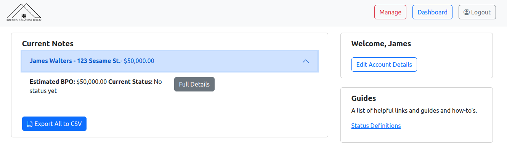
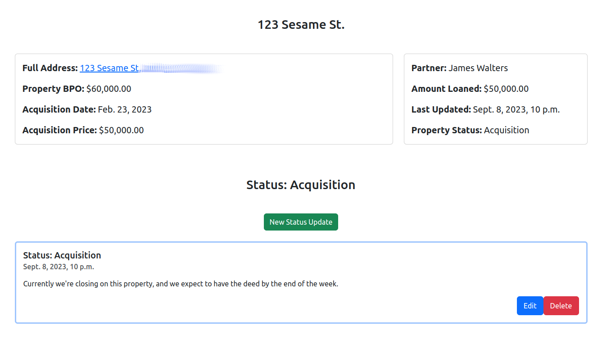
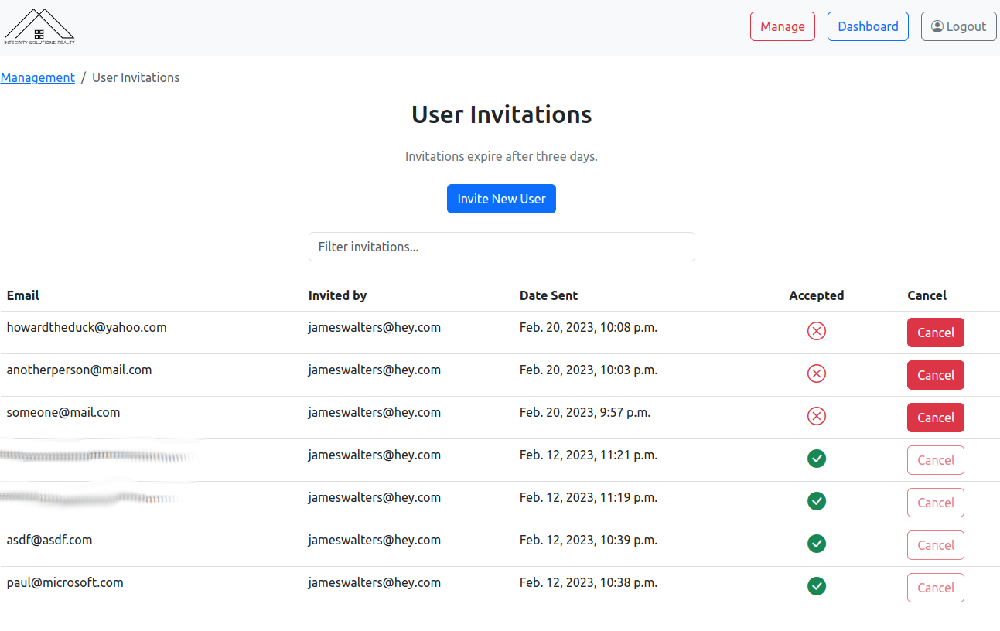
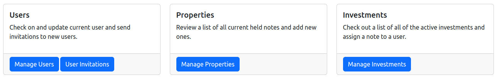

Title: Solving Verticals
Date: 2023-09-08
Author: James Walters
Category: Meta
Tags: Freelance, Show and Tell, portfolio

A little while back, I did some freelancing with a couple of friends for a real estate investment firm. One of my friends knows these guys. They have a great business, but the place where they were falling down was keeping investors in the loop on how things were developing with their properties. One of the big fish asked for a web portal where he could log in and look at his investments and see at a glance how they were doing. That's where we came in.

Being Python/Django guys, we decided to develop the thing in Django. We just used Bootstrap for the frontend, the clients weren't picky. Bootstrap is something we all already had experience with. I know it gets kind of a bad rap because it's been overused, but there's a reason it was overused: it's refreshing to be able to work with a CSS framework that's light on JS. You can move a lot quicker.

Here's what the investor dashboard looks like:

One of my teammates has always had a great eye for UI and design. I like the look of the grid of cards! It wouldn't have occurred to me. The other more data-oriented teammate accommodated an investor request by adding the ability to export everything about his investments as a CSV. He just wanted something he could throw over to his accountant.

If you look at the property, you'll get the details about it at a glance, as well as any status updates that have been posted about it.

Most of my job involved setting up user accounts, which we handled through [django-invitations](https://github.com/jazzband/django-invitations). Fanastic library that makes it trivial to email people and have them set up an account! Here's the screen I made to manage invitations at a glance:

Fundamentally though, this was really just a basic CRUD app with three main models: users, properties, and investments by users in properties. You can see here how the site management page offers you access to all of them:

It's a pretty simple site, but it provided the client with something they really needed: a single place to keep everything relevant to their customers that offers them a view into how things were progressing.

And that's what I want to talk about today.

## Solving Verticals ⬆️

I'm pretty sure I first heard [Will Vincent](http://wsvincent.com/) talk about this on Django Chat one time, so he gets the hat tip. 🎩️

Most businesses really do run on emails and Excel spreadsheets and loose PDFs and that stack of papers on Janice's desk that she's supposed to deliver across town by 3:15 pm. Those of us who write software for a living&mdash;or even just know what software solutions for these sorts of things exist out in the wild&mdash;might be appalled, but yes, they really work this way. It's bonkers.

It really doesn't take much to provide a single, integrated solution that handles everything about a business's workflow from top to bottom. It just involves accommodating the custom abstractions that comprise the building blocks of some particular industry's workflow. For this project, it was investments and properties. For doctors, it might be patients or visits or medical incidents. For lawyers, it might be cases. None of that is rocket science, but if their abstractions are baked into the cake, that's a world of improvement to them over having to figure out how to map their abstractions onto someone else's abstractions in some project management suite.

There are tons of these verticals out there that can be solved with what amounts to minimal effort for the savvy software developer. A lot of these businesses don't have developers on staff (because they don't need them), but they also aren't looking to contract out something like this because they don't realize just how much better an integrated solution can be over the existing "CC: me on that email and forward that attachment" status quo.

Django Developers are [twice as likely to freelance](https://lp.jetbrains.com/django-developer-survey-2022/) over other developers generally. That's because Django's batteries are included. Most of the work you need to do on a freelance project has already been done. This story demonstrates that, yeah, it really doesn't take that much to introduce a software tool that provides a lot of value. There are simply too many businesses and industries that have never had anyone actually build it for them.

If you're looking for ideas for a side gig, I'd recommend thinking in this direction for starters.

<footer style="font-weight: bold; text-align: center;">
Found this helpful? <a href="https://ko-fi.com/iamjameswalters">Buy me a coffee!</a> ☕️
</footer>
